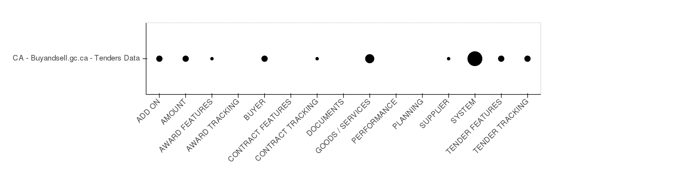
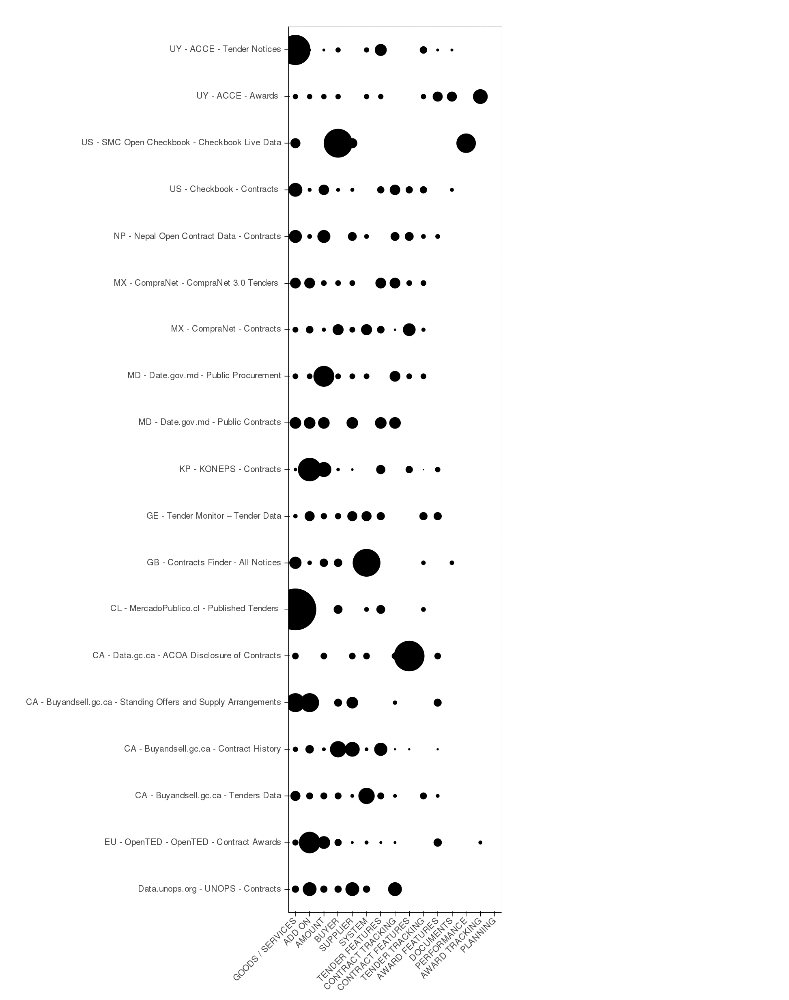

# Supply Side Analysis

## Background
Developing an Open Contracting Data Standard must take into account existingly published data to:

* ensure that any standard is grounded in current reality 
* learn from existing publishers
* try and ensure the standard is readily adoptable.

The standard development process must also accomodate data needs from data users, which is a seperate and complementary process.

This document summarizes and reviews the Supply Side Analysis process that was undertaken between March and May 2014.

## Goals
In conducting a supply-side analysis, we reviewed a lot of datasets. These datasets are useful to later stages of the standard development, and so by collecting them together in a database, we can create a resource for later stages of the process.

In analyzing the data, we were specifically looking at each field in a data set with the following goals:

* What fields should be in a standard is a question for our demand side analysis (asking users what they want and need). But when we ask that question its important to be informed by what's already readily available. Perfection is the enemy of good & knowing what the landscape of available data is can help inform a first draft of the standard. **Goal 1** Provide a landscape of available data
* Gather data to inform the harmonization challenge. Moving forward it is likely that there will be some fields that have a set of allowable values e.g. Contract category: goods, supplies, consultancy, leasing etc. As part of identifying a set of fields for the standard, we will also have to identify those that need to be harmonized so that they can be compared across multiple datasets. **Goal 2** Collect currently used values for fields so we can assess heterogeneity across datasets
* Computers love to identify things, understanding what datasets currently have as unique identifiers will help us to understand what identifiers are available and where challenges might lie with duplication (e.g. if we only have company name, and not an ID, then that name could be mispelt) **Goal 3** Identify unique identifiers.
* We need to follow a contract through its phases. Many publishers release datasets about the different phases seperately. e.g. the tender data is distributed seperately to the award data. We need to document if and how a contract is traceable from one phase to the next. **Goal 4** Document traceability through phases
* In creating a landscape where we identify common fields across multiple datasets, we are a step closer to having data be interoperable. We know that in the not to distant future we will want to attempt to convert some existing datasets into the new OC data standard so we can record mapping that will help that **Goal 5** Facilitate data conversion between existing datasets.
* Accomodate new contracts as we encounter them. In our attempt to build a landscape we need to incorporate different kinds of contracts e.g. framework contracts, land, extractives etc. **Goal 6** Our landscape should be able to document and capture new variations as we uncover them.

## Results

### Creation of Contracting Data Comparison
We built an online platform (built on existing open source tools) to capture and document our supply side analysis. It is available at: [http://ocds.open-contracting.org/opendatacomparison/](http://ocds.open-contracting.org/opendatacomparison/) It has the following features:

* A [list of publishers](http://ocds.open-contracting.org/opendatacomparison/publishers/) allows drill down to an individual publisher record which contains: a description of the publisher, their country, and a geographical identifier to understand what the scope of their data is (national, state, county etc.). You can also see all datasets associated with that publisher.
* A [list of datasets](http://ocds.open-contracting.org/opendatacomparison/datasets/) is filterable by country and displays the number of dataset links available for that dataset. Drilling into an individual dataset, you see: a description of the dataset, a link to the dataset and any documentation, flags to identify whether the dataset is machine readable, and in what formats. In addition, the same view contains a list of links to access the data directly and a link to any datamaps.
* The ability to collect and display the above information in multiple langauges where appropriate.
* Datamaps where we collect field level data on the dataset in both the original language of the dataset and in English. The datamaps classify the fields into concepts and document the kind of data in those fields.

At the time of writing, we had gathered: 28 publishers, 37 datasets, 228 links to data. And completed 19 datamap analyses. These were from a variety of publishers ranging from county level (San Mateo County) to International (United Nations Office for Project Services (UNOPS)), and in English, French, Spanish, Romanian, and Korean.

In addition, the platform is open, in that, anyone can read and review our assessments as well as log in and contribute their own data or analysis as we move forward.

### Goal 1 - Provide a landscape of available data
This goal has formed the backbone of the analysis we have undertaken. It has been an iterative process. Starting from the initial analysis undertaken in May 2013, we have sought to find a unified way of categorizing the existing open contracting data. See Appendix A "Evolution of Buckets" for complete details. The iterative process involved reviewing data, constructing a model that fit the data, modeling that data, reviewing new data, re-constructing the model and so on. Each model was constructed not solely to fit the data, but a model that helps build understanding for the data standard.

The major learning achieved from this process is the cumulative nature of contracting data. As we follow an open contracting process we see an initial set of data such as the buyer and the goods required, and their value. As the process proceeds further data is added on top of this, the supplier that was selected, the details of the contract etc. The nuance in this is that this process also works in reverse. That is that data available later in the process can reflect data from earlier stages in the contracting process.

It is this learning that drove the data model that we have proposed in the [first version of the data standard model](http://ocds.open-contracting.org/standard/r/0__2__0/) where data releases can be compiled into a contracting record.

At the time of writing, we had characterized our categories for grouping open contracting data as follows, with the notes in the third column being just indicative fields, not a comprehensive list:

 
<table cellspacing="0" border="1">
    <tr>
        <td style="border-top: 1px solid #000000; border-bottom: 1px solid #000000; border-left: 1px solid #000000; border-right: 1px solid #000000" rowspan=3 height="259" align="center" valign=middle>CONTRACT +</td>
        <td style="border-top: 1px solid #000000; border-bottom: 1px solid #000000; border-left: 1px solid #000000; border-right: 1px solid #000000" align="left" valign=middle>PERFORMANCE</td>
        <td style="border-top: 1px solid #000000; border-bottom: 1px solid #000000; border-left: 1px solid #000000; border-right: 1px solid #000000" align="left" valign=middle>Spending fields</td>
    </tr>
    <tr>
        <td style="border-top: 1px solid #000000; border-bottom: 1px solid #000000; border-left: 1px solid #000000; border-right: 1px solid #000000" align="left" valign=middle>CONTRACT FEATURES</td>
        <td style="border-top: 1px solid #000000; border-bottom: 1px solid #000000; border-left: 1px solid #000000; border-right: 1px solid #000000" align="left" valign=middle>Status e.g. Active / Terminated / Completed Deliverables / Milestones Final Value</td>
    </tr>
    <tr>
        <td style="border-top: 1px solid #000000; border-bottom: 1px solid #000000; border-left: 1px solid #000000; border-right: 1px solid #000000" align="left" valign=middle>CONTRACT TRACKING</td>
        <td style="border-top: 1px solid #000000; border-bottom: 1px solid #000000; border-left: 1px solid #000000; border-right: 1px solid #000000" align="left" valign=middle>Contract ID Contract Url</td>
    </tr>
    <tr>
        <td style="border-top: 1px solid #000000; border-bottom: 1px solid #000000; border-left: 1px solid #000000; border-right: 1px solid #000000" rowspan=3 height="215" align="left" valign=middle>AWARD +</td>
        <td style="border-top: 1px solid #000000; border-bottom: 1px solid #000000; border-left: 1px solid #000000; border-right: 1px solid #000000" align="left" valign=middle>AWARD FEATURES</td>
        <td style="border-top: 1px solid #000000; border-bottom: 1px solid #000000; border-left: 1px solid #000000; border-right: 1px solid #000000" align="left" valign=middle>Notice Date Num Bids Num Bidders</td>
    </tr>
    <tr>
        <td style="border-top: 1px solid #000000; border-bottom: 1px solid #000000; border-left: 1px solid #000000; border-right: 1px solid #000000" align="left" valign=middle>AWARD TRACKING</td>
        <td style="border-top: 1px solid #000000; border-bottom: 1px solid #000000; border-left: 1px solid #000000; border-right: 1px solid #000000" align="left" valign=middle>Notice ID Notice Url</td>
    </tr>
    <tr>
        <td style="border-top: 1px solid #000000; border-bottom: 1px solid #000000; border-left: 1px solid #000000; border-right: 1px solid #000000" align="left" valign=middle>SUPPLIER</td>
        <td style="border-top: 1px solid #000000; border-bottom: 1px solid #000000; border-left: 1px solid #000000; border-right: 1px solid #000000" align="left" valign=middle>Email, Address, Contact, Etc.</td>
    </tr>
    <tr>
        <td style="border-top: 1px solid #000000; border-bottom: 1px solid #000000; border-left: 1px solid #000000; border-right: 1px solid #000000" rowspan=7 height="917" align="left" valign=middle>TENDER +</td>
        <td style="border-top: 1px solid #000000; border-bottom: 1px solid #000000; border-left: 1px solid #000000; border-right: 1px solid #000000" align="left" valign=middle>BUYER</td>
        <td style="border-top: 1px solid #000000; border-bottom: 1px solid #000000; border-left: 1px solid #000000; border-right: 1px solid #000000" align="left" valign=middle>Email, Address, Contact, Etc.</td>
    </tr>
    <tr>
        <td style="border-top: 1px solid #000000; border-bottom: 1px solid #000000; border-left: 1px solid #000000; border-right: 1px solid #000000" align="left" valign=middle>AMOUNT</td>
        <td style="border-top: 1px solid #000000; border-bottom: 1px solid #000000; border-left: 1px solid #000000; border-right: 1px solid #000000" align="left" valign=middle>Min Max Value Currency Contract Value Currency</td>
    </tr>
    <tr>
        <td style="border-top: 1px solid #000000; border-bottom: 1px solid #000000; border-left: 1px solid #000000; border-right: 1px solid #000000" align="left" valign=middle>GOODS / SERVICES</td>
        <td style="border-top: 1px solid #000000; border-bottom: 1px solid #000000; border-left: 1px solid #000000; border-right: 1px solid #000000" align="left" valign=middle>Code Category Description Title</td>
    </tr>
    <tr>
        <td style="border-top: 1px solid #000000; border-bottom: 1px solid #000000; border-left: 1px solid #000000; border-right: 1px solid #000000" align="left" valign=middle>TENDER FEATURES</td>
        <td style="border-top: 1px solid #000000; border-bottom: 1px solid #000000; border-left: 1px solid #000000; border-right: 1px solid #000000" align="left" valign=middle>Start Date End Date Award Criteria Tender Type Publication Date</td>
    </tr>
    <tr>
        <td style="border-top: 1px solid #000000; border-bottom: 1px solid #000000; border-left: 1px solid #000000; border-right: 1px solid #000000" align="left" valign=middle>TENDER TRACKING</td>
        <td style="border-top: 1px solid #000000; border-bottom: 1px solid #000000; border-left: 1px solid #000000; border-right: 1px solid #000000" align="left" valign=middle>Notice ID Notice Url Notice State</td>
    </tr>
    <tr>
        <td style="border-top: 1px solid #000000; border-bottom: 1px solid #000000; border-left: 1px solid #000000; border-right: 1px solid #000000" align="left" valign=middle>DOCUMENTS</td>
        <td style="border-top: 1px solid #000000; border-bottom: 1px solid #000000; border-left: 1px solid #000000; border-right: 1px solid #000000" align="left" valign=middle>Attached Documents Document Urls</td>
    </tr>
    <tr>
        <td style="border-top: 1px solid #000000; border-bottom: 1px solid #000000; border-left: 1px solid #000000; border-right: 1px solid #000000" align="left" valign=middle>SYSTEM</td>
        <td style="border-top: 1px solid #000000; border-bottom: 1px solid #000000; border-left: 1px solid #000000; border-right: 1px solid #000000" align="left" valign=middle>Original / Amendment Amendment # Amendment Date Amendment Details Total Amendments Amended Fields</td>
    </tr>
    <tr>
        <td height="26" align="left" valign=middle> </td>
        <td align="left" valign=middle> </td>
        <td align="left" valign=middle> </td>
    </tr>
    <tr>
        <td style="border-top: 1px solid #000000; border-bottom: 1px solid #000000; border-left: 1px solid #000000; border-right: 1px solid #000000" height="115" align="left" valign=middle> </td>
        <td style="border-top: 1px solid #000000; border-bottom: 1px solid #000000; border-left: 1px solid #000000; border-right: 1px solid #000000" align="left" valign=middle>ADD ON</td>
        <td style="border-top: 1px solid #000000; border-bottom: 1px solid #000000; border-left: 1px solid #000000; border-right: 1px solid #000000" align="left" valign=middle>Procuring / Awarding Entity Delivery location Bidding system info Appeals info</td>
    </tr>
</table>

It is worth noting that these buckets are not intended to reflect the [components we have used in the Data Standard](http://ocds.open-contracting.org/standard/r/0__2__0/#conceptual-model_1). They provide additional breakdown, in particular, the distinction between tracking and features, that enables us to see nuances in the data. 

Having established these final categories, we took 19 datasets and categorized the fields into these buckets. For each dataset, that allowed us to produce a datamap like this: 

This visualization was chosen because circles are not an effective way to compare sizes. That is, humans are much better at determining that a bar is twice as long as another, whereas they cannot eyeball the same for a circle. This allows us to focus on general weighting rather than precision when comparing across datasets. 

Having conducted this categorization for 19 datasets, we the normalized the dots to account for the fact that some datasets contained many more fields than others, again allowing us to focus on general weighting rather than allowing one dataset to dominate. And finally we sorted these normalized categories allowing us to see which concepts were most featured in the datasets we analyzed.

This resulted in this final datamap seen below. An interactive version of this same datamap is available at the bottom of the [homepage](http://ocds.open-contracting.org/opendatacomparison/):

From this we see that the concepts most frequently used were (in order of most - least frequent):

* Goods / services
* Add on
* Amount 
* Buyer
* Supplier
* System
* Tender features
* Contract tracking
* Contract featurues
* Tender tracking
* Award features
* Documents
* Performance
* Award tracking 
* Planning

There are some limitations, most notably that this analysis will always reflect the datasets reviewed rather than a global truth, and planning and performance data may be under-represented in our sample. However, in our initial gathering of datasets we found tender and award data to be the most readily available datasets.

We have subsequently done a review of three planning datasets, although these have not yet been uploaded to the site.

### Goal 2 - Collect currently used values for fields so we can assess heterogeneity across datasets
As we analyzed each datasets, we took examples of the data in the fields where that data appeared to be standardized. This helped us perform the categorization and is an initial test of heterogeneity.  

Below we see an example from [the canadian tenders datamap](http://ocds.open-contracting.org/opendatacomparison/datamap/15/)

<table class="table"><thead><tr><th>Standardized Fieldname</th><th>Concept</th><th>Type</th><th>Language</th><th>Title</th><th>Description</th><th>Allowable Values</th></tr></thead><tbody><tr><td><a href="/opendatacomparison/datamap/15/field/244/">amendment_date</a></td><td>SYSTEM</td><td>DateTime</td><td>U.S. English</td><td>amendment_date</td><td>Amendment date: The date a tender notice is amended. This includes the date and time published in Eastern time, according to regular publishing schedules.</td><td></td></tr><tr><td><a href="/opendatacomparison/datamap/15/field/242/">award_date</a></td><td>AWARD FEATURES</td><td>DateTime</td><td>U.S. English</td><td>award_date</td><td>Award date: Date on which a contract came into effect.</td><td></td></tr><tr><td><a href="/opendatacomparison/datamap/15/field/246/">contract_award_procedure</a></td><td>TENDER FEATURES</td><td>SingleSelect</td><td>U.S. English</td><td>contract_award_procedure</td><td>Contract award procedure (procurement strategy): the process of awarding a contract to a successful bidder where the contract document will depend on the type of bid solicitation.</td><td>Lowest/Lower Bid, Exclusive Rights, B...</td></tr><tr><td><a href="/opendatacomparison/datamap/15/field/240/">contract_number</a></td><td>CONTRACT TRACKING</td><td>Text</td><td>U.S. English</td><td>contract_number</td><td>Contract number: A unique identifier assigned to a contract.</td><td></td></tr><tr><td><a href="/opendatacomparison/datamap/15/field/239/">contract_sequence_number</a></td><td>SYSTEM</td><td>Number</td><td>U.S. English</td><td>contract_sequence_number</td><td>Contract sequence number: The number of contracts that have been issued by PWGSC against a specific requisition.</td><td></td></tr><tr><td><a href="/opendatacomparison/datamap/15/field/254/">contract_value</a></td><td>AMOUNT</td><td>Currency</td><td>U.S. English</td><td>contract_value</td><td>Value: Specifies the monetary value of the contract.</td><td></td></tr><tr><td><a href="/opendatacomparison/datamap/15/field/253/">currency</a></td><td>AMOUNT</td><td>Currency</td><td>U.S. English</td><td>currency</td><td>Currency: The medium of exchange as defined by reference to the geographical location of the authorities responsible for it.</td><td></td></tr><tr><td><a href="/opendatacomparison/datamap/15/field/250/">customer_info</a></td><td>BUYER</td><td>Text</td><td>U.S. English</td><td>customer_info</td><td>End user information: The end user information identifies the entity (e.g. client department, agency, Crown corporation) on whose behalf the standing offer or supply arrangement has been put in place.</td><td></td></tr><tr><td><a href="/opendatacomparison/datamap/15/field/251/">description</a></td><td>GOODS / SERVICES</td><td>Text</td><td>U.S. English</td><td>description</td><td>Tender notice description: A detailed description of the tender notice. This includes items such as any introductory or purpose text, a description of the notice, background information, instructions, any mandatory text inclusions, and line item information. The information included in this description does not duplicate the information or details found in the attachments, such as clauses or sample documents.</td><td></td></tr><tr><td><a href="/opendatacomparison/datamap/15/field/249/">end_user_entity</a></td><td>BUYER</td><td>Text</td><td>U.S. English</td><td>end_user_entity</td><td>End User: The end user identifies the entity (e.g. client department, agency, Crown corporation) on whose behalf the standing offer or supply arrangement has been put in place.</td><td></td></tr><tr><td><a href="/opendatacomparison/datamap/15/field/245/">gsin</a></td><td>GOODS / SERVICES</td><td>Text</td><td>U.S. English</td><td>gsin</td><td>GSIN Code: The Goods and Services Identification Number (GSIN) is the code used by the federal government to identify generic product descriptions for its procurement activities.</td><td></td></tr><tr><td><a href="/opendatacomparison/datamap/15/field/234/">language</a></td><td>SYSTEM</td><td>SingleSelect</td><td>U.S. English</td><td>language</td><td>Language: The language of the tender notice.</td><td>French, English</td></tr><tr><td><a href="/opendatacomparison/datamap/15/field/248/">procurement_entity</a></td><td>ADD ON</td><td>Text</td><td>U.S. English</td><td>procurement_entity</td><td>Procurement Entity: The Government of Canada organization that was primarily responsible for conducting a given procurement. The procurement entity may not be the organization that is purchasing items through a given contract.</td><td></td></tr><tr><td><a href="/opendatacomparison/datamap/15/field/235/">procurement_entity_name</a></td><td>ADD ON</td><td>Text</td><td>U.S. English</td><td>procurement_entity_name</td><td>Procurement Entity Name: The name of the Government of Canada organization that was primarily responsible for conducting a given procurement. The procurement entity may not be the organization that is purchasing items through a given contract.</td><td>Public Works and Government Services ...</td></tr><tr><td><a href="/opendatacomparison/datamap/15/field/243/">publication_date</a></td><td>SYSTEM</td><td>DateTime</td><td>U.S. English</td><td>publication_date</td><td>Date published: The date a tender notice is publicly published.</td><td></td></tr><tr><td><a href="/opendatacomparison/datamap/15/field/241/">publishing_status</a></td><td>SYSTEM</td><td>SingleSelect</td><td>U.S. English</td><td>publishing_status</td><td>Solicitation status: The various states that a published solicitation may potentially go through.</td><td>Active</td></tr><tr><td><a href="/opendatacomparison/datamap/15/field/237/">reference_number</a></td><td>TENDER TRACKING</td><td>Text</td><td>U.S. English</td><td>reference_number</td><td>Reference number: An identifier assigned to a published tender notice.</td><td></td></tr><tr><td><a href="/opendatacomparison/datamap/15/field/238/">solicitation_number</a></td><td>TENDER TRACKING</td><td>Text</td><td>U.S. English</td><td>solicitation_number</td><td>Solicitation number: A solicitation identifier that is issued by a government department that is found in tender notices and award notices on GETS (ie: NPP, ACAN).</td><td></td></tr><tr><td><a href="/opendatacomparison/datamap/15/field/252/">supplier_info</a></td><td>SUPPLIER</td><td>Text</td><td>U.S. English</td><td>supplier_info</td><td>Supplier information: The name and address of a supplier, who has been registered in VIM and/or SRI, to do business with a government department in supplying goods/services.</td><td></td></tr><tr><td><a href="/opendatacomparison/datamap/15/field/247/">tendering_procedure</a></td><td>TENDER FEATURES</td><td>SingleSelect</td><td>U.S. English</td><td>tendering_procedure</td><td>Tendering procedure: means open tendering procedures, selective tendering procedures and limited tendering procedures.</td><td>Limited,Selective,Open</td></tr><tr><td><a href="/opendatacomparison/datamap/15/field/236/">title</a></td><td>GOODS / SERVICES</td><td>Text</td><td>U.S. English</td><td>title</td><td>Title: A succinct title, or name, that summarizes the tender notice. This title is shared with any resulting contract and tender award notice, in both official languages.</td><td></td></tr></tbody></table>

Due to time constraints in performing the data gathering and analysis, we currently have an incomplete set of this kind of data as it is very time consuming to help. However, one of our volunteer developers that we met at the PyCon sprints is just finishing a script that will autogenerate this data for us, which will prove extremely useful as we move into phase two of our standard development.

In addition to being able to view this data in each datamap, the fields have been aggregated to view by concept, and these are available [here](http://ocds.open-contracting.org/opendatacomparison/datamap/fieldallowable/).

Although there is further analysis to be done in the second half of the data standard development process as we build our coded lists, in reviewing all the data by hand lessons have been learned. In particular, there is a high level of heterogeneity in the data where we would like to see standardization. For example:

 * In [tender features](http://ocds.open-contracting.org/opendatacomparison/datamap/fieldallowable/46/) many publishers supply a description of the type of process used for vendor selection - e.g. competitive bidding, limited competition, sole source. However, the terminology is not consistent. In addition, some publishers provide a yes/no field for "competitive bidding."
 * In a similar manner, they also provide a description of the selection method e.g. lowest cost, highest quality, but this is not consistent.
 * In [goods and services](http://ocds.open-contracting.org/opendatacomparison/datamap/fieldallowable/42/) publishers are providing details of the items being purchased but this is often in a free text field which will be hard to make comparable either within datasets or across them.
 * Again in goods and services, many people are using categorization to place these goods in a category, but no single categorization standard, such as CPV, dominates, and some do not describe what categorization system is being used.
 * While there was a lot of [buyer data](http://ocds.open-contracting.org/opendatacomparison/datamap/fieldallowable/37/) it was expressed very differently. It will be interesting to see from the demand side, what information is needed about the purchasing department, and in what format.
 
In better news, a lot of datasets contract_value was [readily identifiable](http://ocds.open-contracting.org/opendatacomparison/datamap/field/41/) as a common field.

### Goal 3 Identify unique identifiers & Goal 4 Document traceability through phases
In the second phase of the standard development we will be diving into unique identifiers in more detail. However, what we can observe already is that unique identifiers are not used for either [buyer](http://ocds.open-contracting.org/opendatacomparison/datamap/field/37/) or [supplier](http://ocds.open-contracting.org/opendatacomparison/datamap/field/45/). The only ids that are used for buyer and supplier in the Georgian dataset appear to be internal identifiers only. Identification is done through the name of the organization, which is liable to errors.

[Tenders](http://ocds.open-contracting.org/opendatacomparison/datamap/field/44/) and [awards](http://ocds.open-contracting.org/opendatacomparison/datamap/field/43/) were given their own unique identifiers, and in systems where tender notices and awards were published from the same system they were generally identified together (e.g. UK & Canada).

Mexico, United Kingdom, Chile, Uruguay, Moldova, and Canada all had information both on the Tender/Award and the contract phase. However, initial analysis was that traceability across the phases was not robust, although this needs further research.

### Goal 5 Facilitate data conversion between existing datasets & Goal 6 Our landscape should be able to document and capture new variations as we uncover them.
The data comparison tool is well poised to facilitate further data analysis as we move into our second phase. We are able to query the existing data when new research questions arise and it is easily extensible to gather new kinds of data. In particular, we will be able to store the field level mapping between the new data standard fields and our attempt to map the standard onto existing datasets.

## Next steps
As mentioned in the previous section, we will be continuing to build on this initial tranche of research as we work to solve specific questions in building the standard, such as mechanisms for unique identifiers, and challenges with codified lists.  

It was good to see in the data landscape that a good number of publishers are publishing tender feature information such as the type of competition or the method of selection. A strong effort is underway to build out the use cases that document the demand for contracting data and the next step will be to examine the kind of data desired alongside our findings of the kind of data available to understand where opportunities and challenges lie.

We have also had interest from at least one community member in exploring the data that we have gathered together and we will continue to support others interested in our findings as best as possible. The code for all the products is available as open-source code at http://github.com/open-contracting/, and we should think about how to full open up the data on the site, maybe by making a sanitized version of the database available (with users & session keys removed, for example).

